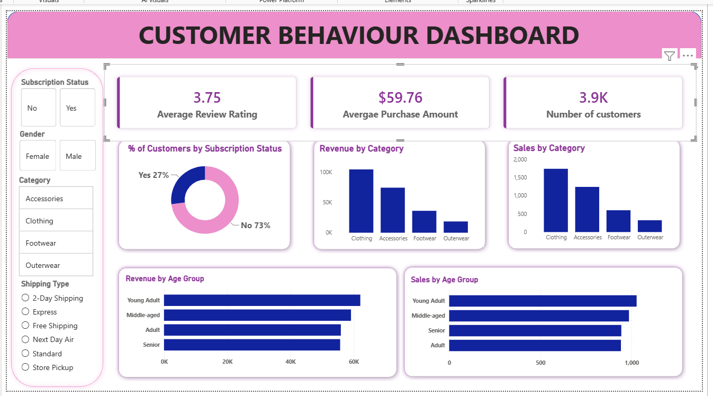

# Customer Behaviour Analysis & Dashboard
# Customer Behaviour Analysis & Dashboard

## Overview

This project focuses on analyzing customer purchasing behavior using Python, SQL, and Power BI. The objective was to transform raw customer shopping data into meaningful business insights through data cleaning, exploratory data analysis (EDA), SQL-based analysis, and interactive dashboard development.

The project demonstrates an end-to-end data analytics workflow, from data preparation and analysis to visualization and reporting. The insights generated help understand customer demographics, purchasing patterns, revenue drivers, and customer segments.

---

## Project Objective

The primary goal of this project is to analyze customer shopping behavior and identify trends that can support business decision-making. By combining Python, SQL, and Power BI, the project converts raw transactional data into actionable insights.

---

## Dataset

The dataset contains customer shopping behavior information, including:

* Customer ID
* Age
* Gender
* Item Purchased
* Category
* Purchase Amount
* Subscription Status
* Shipping Type
* Review Rating
* Previous Purchases
* Season
* Product Attributes (Size, Color, etc.)

---

## Tools & Technologies

| Tool                                        | Purpose                               |
| ------------------------------------------- | ------------------------------------- |
| Python (Pandas, NumPy, Matplotlib, Seaborn) | Data Cleaning & EDA                   |
| PostgreSQL                                  | Data Querying & Analysis              |
| Power BI                                    | Dashboard Development & Visualization |
| Jupyter Notebook                            | Analysis Environment                  |
| VS Code                                     | Python & SQL Development              |

---

## Project Workflow

### 1. Data Loading

* Imported the dataset using Pandas.
* Performed initial data inspection.
* Checked data types and dataset dimensions.

### 2. Data Cleaning

* Handled missing values.
* Removed duplicate records.
* Standardized column formats.
* Validated data consistency.
* Created derived features such as age groups.

### 3. Exploratory Data Analysis (EDA)

Performed analysis to identify patterns and trends, including:

* Customer distribution by age and gender
* Revenue contribution by product category
* Purchase amount analysis
* Subscription status analysis
* Review rating analysis
* Seasonal purchasing trends
* Shipping preference analysis

### 4. SQL Analysis

Loaded the cleaned dataset into PostgreSQL and executed SQL queries to answer business questions.

Examples include:

* Revenue by product category
* Customer segmentation based on previous purchases
* Average purchase amount by demographic groups
* Revenue by age groups
* Subscription behavior analysis
* Customer count by segment
* Top-performing categories

---

## Dashboard

An interactive Power BI dashboard was created to visualize key business metrics and customer behavior.

### Key KPIs

* Average Review Rating: **3.75**
* Average Purchase Amount: **$59.76**
* Total Customers: **3.9K**

### Dashboard Visualizations

* Customer Distribution by Subscription Status
* Revenue by Category
* Sales by Category
* Revenue by Age Group
* Sales by Age Group

### Interactive Filters

* Gender
* Category
* Subscription Status
* Shipping Type

### Features

* Dynamic filtering and cross-filtering
* Business-friendly KPI cards
* Interactive visualizations
* Easy exploration of customer segments and revenue trends

---

## Key Findings

### Customer Insights

* Young Adult customers generated the highest revenue among all age groups.
* Clothing was the highest revenue-generating category.
* Most customers were non-subscribers.
* The average customer review rating was 3.75.
* The average purchase amount was $59.76.

### Business Insights

* Revenue was concentrated within a few product categories.
* Younger customer groups contributed significantly to overall sales.
* Subscription adoption was relatively low, indicating growth opportunities.
* Shipping preferences varied across customer segments.

---

## Skills Demonstrated

* Data Cleaning and Transformation
* Exploratory Data Analysis (EDA)
* SQL Query Writing
* Data Visualization
* Dashboard Development
* Business Analysis
* Insight Generation
* Data Storytelling

---

## Deliverables

* Python Data Cleaning Notebook
* Exploratory Data Analysis (EDA)
* SQL Query Scripts
* Power BI Dashboard (.pbix)
* Project Documentation

---

## How to Run

### Python Analysis

```bash
pip install pandas numpy matplotlib seaborn

jupyter notebook
```

### SQL Analysis

1. Create a PostgreSQL database.
2. Import the cleaned dataset.
3. Execute the SQL scripts.
4. Review the generated insights.

### Power BI Dashboard

1. Open the `.pbix` file in Power BI Desktop.
2. Refresh the dataset connection.
3. Explore dashboard filters and visualizations.

---

## Dashboard Preview

<p align="center">
  
</p>

The dashboard provides insights into customer demographics, revenue distribution, sales performance, subscription status, and purchasing behavior through interactive visualizations and filters.

## Conclusion

This project demonstrates a complete data analytics workflow using Python, SQL, and Power BI to transform raw customer data into actionable business insights. Through data cleaning, analysis, visualization, and reporting, the project showcases practical skills in data analytics, business intelligence, and data-driven decision-making.


